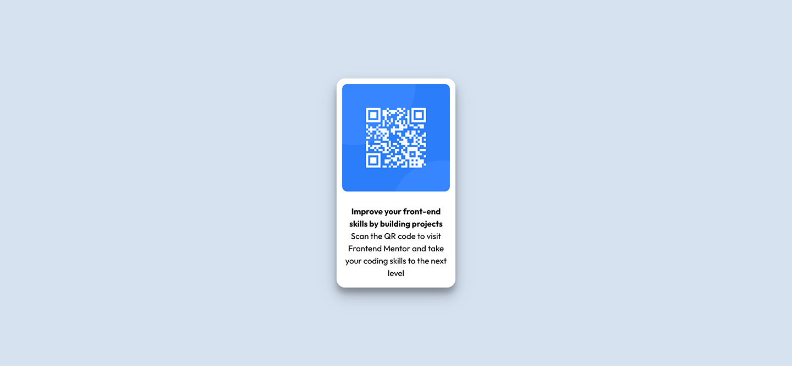

# Frontend Mentor - QR code component solution

This is a solution to the [QR code component challenge on Frontend Mentor](https://www.frontendmentor.io/challenges/qr-code-component-iux_sIO_H). Frontend Mentor challenges help you improve your coding skills by building realistic projects. 

## Table of contents

- [Overview](#overview)
  - [Screenshot](#screenshot)
  - [Links](#links)
- [My process](#my-process)
  - [Built with](#built-with)
  - [What I learned](#what-i-learned)
  - [Continued development](#continued-development)
  - [Useful resources](#useful-resources)
- [Author](#author)
- [Acknowledgments](#acknowledgments)

**Note: Delete this note and update the table of contents based on what sections you keep.**

## Overview

### Screenshot



### Links

- Live Site URL: [https://qr-component-mu.vercel.app/](https://qr-component-mu.vercel.app/)

## My process

### Built with

- Semantic HTML5 markup
- CSS custom properties
- Flexbox
- Mobile-first workflow

### What I learned

I stepped back into Frontend Development with this project as it's been some time since I've worked on HTML/CSS. I've been spending time on algorithms. I struggled with the vertical size of the parent div being large enough to hold the children elements. I solved this by using the below:

```css
    .qr-container {
        height: auto;
    }
```

### Continued development

I would like to grow into using CSS best practices that are efficient and scalable. I would like to continue focusing on the way parent width plays with children elements.

## Author

- Website - [Johnathan Figueroa](https://github.com/johnfigs)
- Frontend Mentor - [@johnfigs](https://www.frontendmentor.io/profile/johnfigs)

**Note: Delete this note and add/remove/edit lines above based on what links you'd like to share.**

